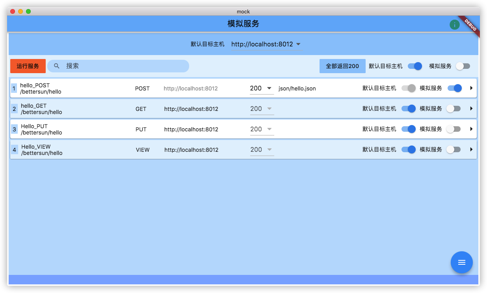
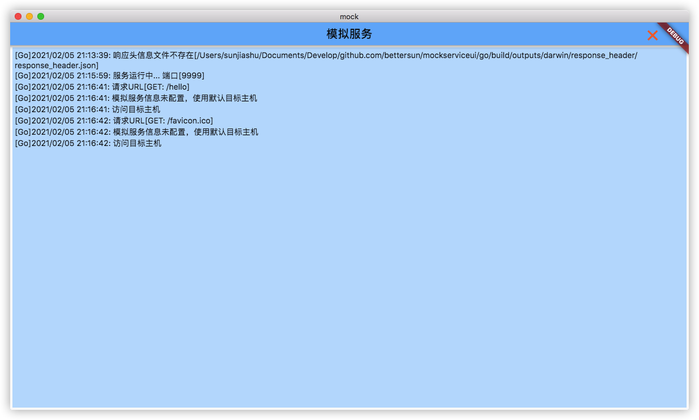
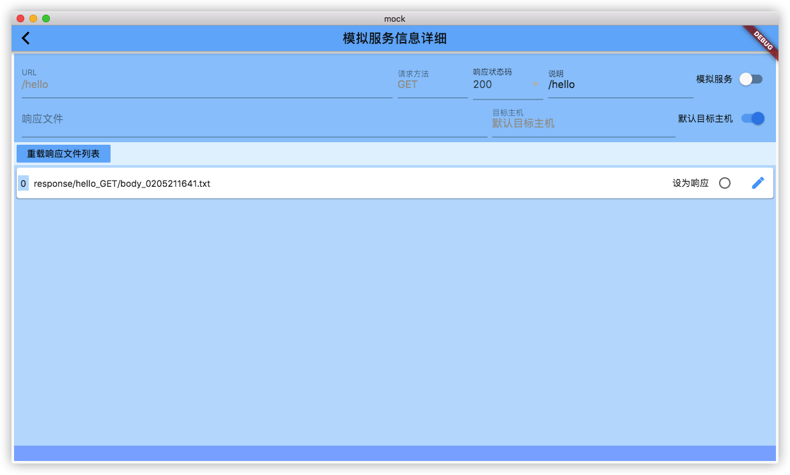

# mockserviceui
简单的模拟服务工具（界面）

使用 go-flutter 开发

依赖Github仓库:  
https://github.com/bettersun/mockservice
https://github.com/bettersun/moist

主界面：  

日志界面：  

配置详细界面：  


## 简介

前端连接到该工具，该工具实现请求转发、请求和响应信息的保存。  
该工具也可提供模拟服务，即作为一个虚拟的服务器提供所需的响应数据。  


## 运行

把 config 目录下的文件放在可执行程序所在目录，配置好后运行即可。  

## 配置文件

程序运行所需的配置，修改该文件的内容后，需要重新启动该工具以生效。  
格式为 yaml 格式。

config.yml
``` yml
# 此文件内容修改后需重启
# 端口
port: 9999
# 日志文件
logFile: mock.log
# 日志等级
# -1: DEBUG
# 0: INFO
# 1: WARN
# 2: ERROR
# 3: FATAL
logLevel: 0
# 主机文件
hostFile: host.yml
# 模拟服务信息文件
infoFile: info.yml
# 使用模拟服务通用响应头
useMockCommonResponseHeader: true
```

1. 端口

    端口为该工具的监听接口，前端连接到此工具所在主机的该端口。  
    本机连接的话，手机的模拟器不能连接 127.0.0.1 或者 localhost。  

    若不配置，默认使用 9527。  

2. 日志文件

    日志文件为该工具运行时日志保存的文件名。  

    若不配置，默认使用 mock.log。  

3. 日志等级

    日志保存的等级，高于或等于该等级的日志会被保存。  

    数字对应等级为：  
    -1: DEBUG
    0: INFO
    1: WARN
    2: ERROR
    3: FATAL

    若不配置，默认使用 0 (信息)。  

4. 主机文件

    前端通过该工具连接的对象主机列表的文件名。  

    若不配置，默认使用 host.yml。

5. 模拟服务信息文件

    前端请求的各个 URL 对应的配置信息列表的文件名。  

    若不配置，默认使用 info.yml。  

6. 使用模拟服务通用响应头

    该工具转发请求时，真实主机返回的响应头信息会保存。  
    位置为 response_header/response_header.json。  
    
    不使用该工具转发，使用该工具提供模拟服务时，对于各个 URL 的响应，需要响应头信息。  
    默认提供了一个通用响应头，response_header/common_response_header.json。  

    对于 URL 的请求，首先会查找是否存在真实主机的响应头。  
    如果不存在，并且配置文件里使用模拟服务通用响应头为 true 时，则会使用 response_header/common_response_header.json 的内容作为模拟服务的响应头。  

    对于 URL 的请求，首先会查找是否存在真实主机的响应头，如果不存在，并且配置文件里使用模拟服务通用响应头为 false 时，则不作特殊处理。  

    若不配置，默认使用 false。  

## 主机文件

前端需要连接的主机列表，包括主机 IP 和服务监听的端口，也可使用服务映射的根 URL。  

配置文件中的配置项为： hostFile  

格式为 yaml 格式。  

``` yml
- http://localhost:8012
- http://127.0.0.1:8015
- http://192.168.9.12:8016
- http://www.helloworld.cn
```

## 模拟服务信息

前端请求的各个 URL（包括请求方法）对应的配置信息列表，该工具通过该配置信息来转发请求或提供模拟服务。  

若不配置该文件，前端通过该工具转发请求时，会自动记录对应的的模拟服务信息并保存到文件。  
有个前提是工具运行时必须指定默认目标主机，这样工具才能知道请求要转发的目标主机。  

配置文件中的配置项为： infoFile  

格式为 yaml 格式。  

``` yml
- url: /bettersun/hello
  method: POST
  targetHost: http://localhost:8012
  useDefaultTargetHost: true
  useMockService: true
  statusCode: 200
  responseFile: json/hello.json
  description: hello_POST
- url: /bettersun/hello
  method: GET
  targetHost: http://localhost:8012
  useDefaultTargetHost: true
  useMockService: false
  statusCode: 200
  responseFile: ""
  description: hello_GET
- url: /bettersun/hello
  method: PUT
  targetHost: http://localhost:8012
  useDefaultTargetHost: true
  useMockService: false
  statusCode: 200
  responseFile: ""
  description: Hello_PUT
```

1. url

    前端请求的 URL。  

2. method

    前端请求URL 时的请求方法。  
    GET/POST/PUT/DELETE 等。  

3. targetHost

    目标主机，为前端请求需要连接的真实主机，即该工具转发请求需要连接的真实主机。  
    当使用模拟服务（useMockService 为 true）时，则由该工具提供模拟服务，不再连接目标主机。  

4. useDefaultTargetHost

    使用默认目标主机标志。  

    程序启动时，默认目标主机为主机文件里配置的第一个。  
    可在画面中选择默认目标主机，适用于前端请求的大部分URL为同一台主机提供真实服务的情况。  

    当 使用默认目标主机标志 为 true 时，则使用当前选择的默认目标主机。  
    若 使用默认目标主机标志 为 false 时，则使用配置信息中的目标主机（targetHost）。  

5. useMockService

    使用模拟服务标志。  

    当 使用模拟服务标志 为 true 时，该工具不会转发前端请求的 URL，会对前端请求的 URL提供模拟服务。  
    当 使用模拟服务标志 为 false 时，该工具会转发前端请求的 URL。  

6. statusCode

    模拟服务响应状态码。  

    当使用模拟服务时，该工具对于前端请求的 URL 返回的响应状态码。  

7. responseFile

    模拟服务响应文件名。  

    当使用模拟服务时，该工具对于前端请求的 URL 返回的响应体内容所在的文件。  
    对应文件里保存模拟服务的响应体内容。  

    **文件的路径规则：**

    响应体内容为 JSON 时，路径为 response/URL(转换)_请求方法/body_MdHms.json  
    响应体内容非 JSON 时，路径为 response/URL(转换)_请求方法/body_MdHms.txt  

    - URL(转换) 为将请求 URL 去掉首个斜线，并将斜线转为下划线后的值。  
    例:  
    /bettersun/hello  
    转换后为  
    bettersun_hello  

    - 请求方法为大写。  

    - MdHms 为 月日时分秒各两位的数字。  

    文件例：  

    response/bettersun_hello_GET/body_0112091212.txt  
    response/bettersun_hello_GET/body_0112091216.json  

8. description

    该 URL（包括请求方法）对应的说明或描述。  

## 模拟服务通用响应头

位置是 response_header/common_response_header.json  

可自定义内容，默认的三个选项为支持跨域、gzip 压缩和响应格式为json(UTF8)。  

格式为 json 格式。  

``` json
{
    "Access-Control-Allow-Origin": [
        "*"
    ],
    "Content-Encoding": [
        "gzip"
    ],
    "Content-Type": [
        "application/json;charset=UTF-8"
    ]
}
```

该工具转发请求时，真实主机返回的响应头信息会保存。  
位置为 response_header/response_header.json。  

不使用该工具转发，使用该工具提供模拟服务时，对于各个 URL 的响应，需要响应头信息。  
默认提供了一个通用响应头，response_header/common_response_header.json。  

对于 URL 的请求，首先会查找是否存在真实主机的响应头。  
如果不存在，并且配置文件里使用模拟服务通用响应头为 true 时，则会使用 response_header/common_response_header.json 的内容作为模拟服务的响应头。  

对于 URL 的请求，首先会查找是否存在真实主机的响应头，如果不存在，并且配置文件里使用模拟服务通用响应头为 false 时，则不作特殊处理。  

## 请求响应记录

通过该工具转发请求到真实的目标主机时，会自动记录请求信息和响应信息。  

1. 记录的请求信息

    记录的请求信息保存在下面目录。  

    requeset/URL(转换)_请求方法/req_MdHms.json  

    - URL(转换) 为将请求 URL 去掉首个斜线，并将斜线转为下划线后的值。  
    例:  
    /bettersun/hello  
    转换后为  
    bettersun_hello  

    - 请求方法为大写。  

    - MdHms 为 月日时分秒各两位的数字。  

    记录的请求信息内容为 请求的 URL、请求头和请求体。  

2. 记录的响应信息

    记录的响应头信息保存在下面文件。  
    response_header/response_header.json  

    文件内容是 URL(转换)_请求方法 作为键，响应头信息作为值的 Map 转换后的 JSON 文本。  

    当使用模拟服务时，会首先查找该文件并从该文件中查找 URL（包括请求方法）对应的响应头信息。若该文件不存在或查找不到对应的响应头信息，并且配置文件里的使用模拟服务通用响应头为 true 时，则会读取模拟服务通用响应头文件的内容作为响应头信息返回。  
    
    响应体信息保存在下面目录。  

    响应体内容为 JSON 时， 路径为 response/URL(转换)_请求方法/body_MdHms.json
    响应体内容非 JSON 时，路径为 response/URL(转换)_请求方法/body_MdHms.txt

    - URL(转换) 为将请求 URL 去掉首个斜线，并将斜线转为下划线后的值。  
    例:  
    /bettersun/hello  
    转换后为  
    bettersun_hello  

    - 请求方法为大写。  

    - MdHms 为 月日时分秒各两位的数字。  

    文件例：  

    response/bettersun_hello_GET/body_0112091212.txt  
    response/bettersun_hello_GET/body_0112091216.json  

## 程序界面及操作

## 主界面

### 界面简介

1. 标题栏

    程序启动后，右上角会显示一个信息图标，点击可切换到运行信息界面显示程序运行时的信息。  

2. 头部面板 

    标题栏下面的部分是头部面板，现在只有一个项目，为 默认目标主机 下拉框，在这里可以设定默认目标主机。  
    下拉框里的内容是从配置文件里设定的主机文件中读取，如果配置文件里没有设置，默认从程序所在目录的 host.yml 中读取。  

3. 操作面板

    左边是 运行服务 按钮。  
    接着是搜索栏。  
    再往右边是 全部返回200 按钮。
    接着是 默认目标主机 全局开关 和 模拟服务 全局开关。  

4. 详细面板

    详细面板用来表示 模拟服务信息列表。  
    这里的模拟服务信息即 URL（包括 HTTP 请求）对应的信息。  
    根据信息的设定，服务会转发请求或提供模拟服务。  

5. 模拟服务信息Card

    最左侧为数据行号。  
    
    之后的一列上面为 URL 的描述，下面为 具体的URL（不包括请求方法和目标主机），后面一列为请求方法。  

    接着是转发请求对应的目标主机。  
    当前信息的 默认目标主机 为开时，显示默认主机。  
    当前信息的 默认目标主机 为关时，显示配置文件中模拟服务信息文件里的对应 URL（包括请求方法）的目标主机地址。  
    当前信息的 模拟服务 为开时，该项目不会被使用，文字显示为灰色。  

    再后面的两列为响应状态和模拟响应文件。  
    这两列在 当前信息的 模拟服务 为开时会被使用。  
    响应状态码为使用该工具的模拟服务时的响应状态码。  
    模拟响应文件为使用该工具的模拟服务时的响应体内容的来源文件。  

    最后为 默认目标主机 开关 和 模拟服务 开关。  
    模拟服务 为开时，默认目标主机不会被使用，显示为灰色。此时该工具提供模拟服务响应前端的请求。  
    模拟服务 为关时，默认目标主机可用，正常显示。此时该工具转发前端的请求到目标主机，并从目标主机接收响应后返回给前端。  

    最后是一个小箭头图标。  
    点击该图标，会跳转到当前模拟服务信息的详细画面。  

    所有对模拟服务信息的改动都会即时反映到该工具的监听处理中。  

6. FAB

    右下角的 FAB，点击后会显示两个选项，重新加载模拟服务信息 和 保存模拟服务信息。  

    重新加载模拟服务信息 点击后，会从配置文件设置的文件中重新读取主机信息和模拟服务信息，并在画面表示。该操作会还原当前在画面进行的设置。  

    保存模拟服务信息 点击后，会把当前画面进行的设置保存到配置文件设置的主机文件和模拟服务信息文件中。原来的配置会备份到程序所在目录下的 backup 目录下。  

### 运行服务

    程序启动后，不会自动运行服务监听请求，需要手动运行服务。  
    点击 运行服务 按钮，可启动服务监听请求。  
    画面是下方的状态栏会有提示信息。  
    运行信息界面也会有相应信息。  

### 全部返回200

    点击 全部返回200 后，详细面板的模拟服务信息列表里所有信息的响应状态码都会变成200。  

### 默认目标主机全局开关

    切换该开关时，详细面板的模拟服务信息列表里所有信息的默认目标主机都会切换为对应的状态。  
    当模拟服务全局开关为开时，该开关不被使用，表示为灰色。  

### 模拟服务全局开关

    切换该开关果，详细面板的模拟服务信息列表里所有信息的模拟服务都会切换为对应的状态。  

## 模拟服务信息详细画面

### 界面简介

1. 头部面板

    模拟服务信息的详细内容。  

    默认目标主机开关 和 模拟服务开关 和主界面列表里各信息的对应开关功能相同。  

    默认目标主机开关为关，且模拟服务开关为关时，可修改目标主机。  

    描述可修改。  

2. 操作面板

    重新加载响应文件，会重新加载该 URL（包括请求方法）对应的响应文件列表。  
    加载目录为 response/URL(转换)_请求方法。  
    URL(转换)的规则和请求方法参照上面说明。  

3. 详细面板

    详细面板里表示的是响应文件列表。  
    点击各文件后的 设为响应 后，头部面板里的响应文件会变为对应的文件。  

### 返回

    点击返回，当前画面的设置信息会反映到主界面。  

## 未完成内容

端口冲突未解决，可先确认程序使用的端口未被占用后再启动程序。  